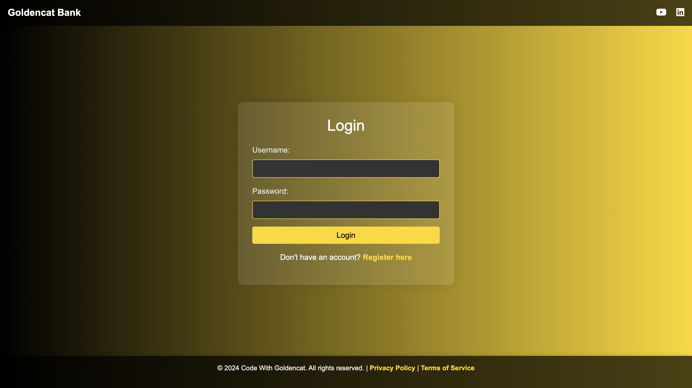
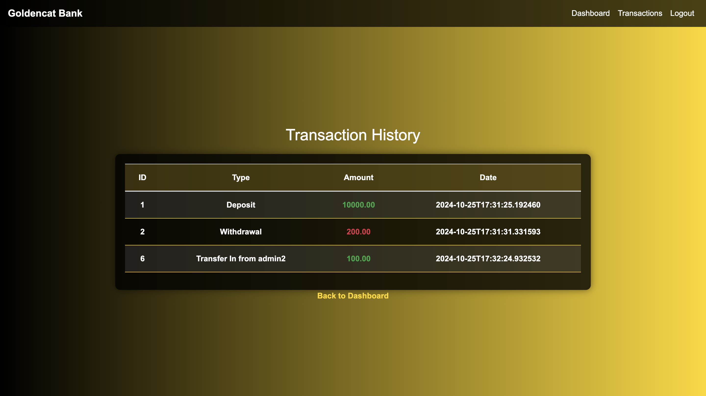

# End-to-End Bank Application Deployment using DevSecOps on AWS EKS
A multi-tier banking application built with Java Spring Boot, with multiple deployment options.

## Architecture Diagrams



## Prerequisites
1. AWS Account with appropriate permissions
2. AWS CLI configured
3. kubectl installed
4. Docker installed
5. AWS EC2 instance (t2.medium)
6. eksctl installed (for EKS deployment)
7. Helm installed (for ingress controller)

## Deployment Options
1. [Docker Deployment](#docker-deployment)
2. [Docker Compose Deployment](#docker-compose-deployment)
3. [AWS EKS Deployment](#eks-deployment)

## Docker Deployment
### 1. Clone the Repository
```bash
git clone https://github.com/DevMadhup/Springboot-BankApp.git
cd Springboot-BankApp
```

### 2. Install Docker and Required Tools
```bash
# Update system packages
sudo apt update -y

# Install Docker
sudo apt install docker.io -y

# Add user to docker group
sudo usermod -aG docker $USER && newgrp docker

# Verify Docker installation
docker --version
```

### 3. Build and Deploy
```bash
# Build Docker image (replace with your Docker Hub username)
docker build -t yourdockerhub/bankapp:latest .

# Create dedicated network for the application
docker network create bankapp-network

# Deploy MySQL
docker run -d \
  --name mysql \
  --network bankapp-network \
  -e MYSQL_ROOT_PASSWORD=Test@123 \
  -e MYSQL_DATABASE=BankDB \
  mysql:latest

# Deploy Bank Application
docker run -d \
  --name bankapp \
  --network bankapp-network \
  -p 8080:8080 \
  -e SPRING_DATASOURCE_URL="jdbc:mysql://mysql:3306/BankDB?useSSL=false&allowPublicKeyRetrieval=true&serverTimezone=UTC" \
  -e SPRING_DATASOURCE_USERNAME=root \
  -e SPRING_DATASOURCE_PASSWORD=Test@123 \
  yourdockerhub/bankapp:latest

# Verify deployment
docker ps
```

## Docker Compose Deployment
### 1. Install Docker Compose
```bash
sudo apt update
sudo apt install docker-compose-v2 -y
```

### 2. Create docker-compose.yml
```yaml
version: '3.8'

services:
  mysql:
    image: mysql:latest
    container_name: mysql
    environment:
      MYSQL_ROOT_PASSWORD: Test@123
      MYSQL_DATABASE: BankDB
    networks:
      - bankapp-network
    volumes:
      - mysql-data:/var/lib/mysql
    healthcheck:
      test: ["CMD", "mysqladmin", "ping", "-h", "localhost"]
      interval: 10s
      timeout: 5s
      retries: 5

  bankapp:
    build: .
    container_name: bankapp
    ports:
      - "8080:8080"
    environment:
      SPRING_DATASOURCE_URL: jdbc:mysql://mysql:3306/BankDB?useSSL=false&allowPublicKeyRetrieval=true&serverTimezone=UTC
      SPRING_DATASOURCE_USERNAME: root
      SPRING_DATASOURCE_PASSWORD: Test@123
    depends_on:
      mysql:
        condition: service_healthy
    networks:
      - bankapp-network

networks:
  bankapp-network:
    driver: bridge

volumes:
  mysql-data:
```

### 3. Deploy using Docker Compose
```bash
# Start the application
docker compose up -d

# Check logs
docker compose logs -f

# Stop the application
docker compose down
```

## EKS Deployment
### 1. Install Required Tools
```bash
# Install AWS CLI
curl "https://awscli.amazonaws.com/awscli-exe-linux-x86_64.zip" -o "awscliv2.zip"
unzip awscliv2.zip
sudo ./aws/install

# Install kubectl
curl -LO "https://dl.k8s.io/release/$(curl -L -s https://dl.k8s.io/release/stable.txt)/bin/linux/amd64/kubectl"
sudo install -o root -g root -m 0755 kubectl /usr/local/bin/kubectl

# Install eksctl
curl --silent --location "https://github.com/weaveworks/eksctl/releases/latest/download/eksctl_$(uname -s)_amd64.tar.gz" | tar xz -C /tmp
sudo mv /tmp/eksctl /usr/local/bin

# Install Helm
curl -fsSL -o get_helm.sh https://raw.githubusercontent.com/helm/helm/main/scripts/get-helm-3
chmod 700 get_helm.sh
./get_helm.sh

# Install ArgoCD CLI
curl -sSL -o argocd-linux-amd64 https://github.com/argoproj/argo-cd/releases/latest/download/argocd-linux-amd64
sudo install -m 555 argocd-linux-amd64 /usr/local/bin/argocd
rm argocd-linux-amd64
```

### 2. Create EKS Cluster
```bash
# Create cluster without nodegroup
eksctl create cluster \
  --name bankapp-cluster \
  --region eu-west-1 \
  --without-nodegroup

# Associate IAM OIDC provider
eksctl utils associate-iam-oidc-provider \
  --region=eu-west-1 \
  --cluster=bankapp-cluster \
  --approve

# Create nodegroup
eksctl create nodegroup \
  --cluster=bankapp-cluster \
  --region=eu-west-1 \
  --name=bankapp-ng \
  --node-type=t2.medium \
  --nodes=2 \
  --nodes-min=2 \
  --nodes-max=2 \
  --node-volume-size=15 \
  --ssh-access \
  --ssh-public-key=mega-project-key
```

### 3. Install and Configure ArgoCD
```bash
# Create ArgoCD namespace
kubectl create ns argocd

# Install ArgoCD
kubectl apply -n argocd -f https://raw.githubusercontent.com/argoproj/argo-cd/stable/manifests/install.yaml

# Configure ArgoCD service
kubectl patch svc argocd-server -n argocd -p '{"spec":{"type": "NodePort"}}'

# Get ArgoCD admin password
kubectl get secret argocd-initial-admin-secret -n argocd -o jsonpath="{.data.password}" | base64 -d

# Login to ArgoCD (replace IP and port with your ArgoCD server details)
argocd login <ARGOCD_SERVER_IP>:<PORT> --username admin

# List connected clusters
argocd cluster list

# Get current context
kubectl config get-contexts

# Add cluster to ArgoCD
argocd cluster add <CONTEXT_NAME> --name bankapp-cluster
```

### 4. Deploy Application Components
```bash
# Create namespace for application
kubectl create namespace bankapp-namespace

# Create ConfigMap and Secrets
kubectl apply -f kubernetes/configmap.yml
kubectl create secret generic mysql-secret \
  --from-literal=MYSQL_ROOT_PASSWORD=Test@123 \
  --from-literal=SPRING_DATASOURCE_PASSWORD=Test@123 \
  -n bankapp-namespace

# Deploy MySQL and Application
kubectl apply -f kubernetes/mysql-deployment.yml
kubectl apply -f kubernetes/mysql-service.yml
kubectl apply -f kubernetes/bankapp-deployment.yml
kubectl apply -f kubernetes/bankapp-service.yml

# Configure service as NodePort
kubectl patch svc bankapp-service -n bankapp-namespace -p '{"spec": {"type": "NodePort"}}'

# Verify deployments
kubectl get all -n bankapp-namespace
kubectl get svc -n bankapp-namespace
```

### 5. Configure Ingress
```bash
# Add and update Helm repo
helm repo add ingress-nginx https://kubernetes.github.io/ingress-nginx
helm repo update

# Install Nginx Ingress Controller
helm install ingress-nginx ingress-nginx/ingress-nginx \
  --namespace ingress-nginx \
  --create-namespace

# Verify Ingress
kubectl get svc -n ingress-nginx
kubectl get ing -n bankapp-namespace
```

### 6. Install Cert-Manager
```bash
# Install cert-manager
kubectl apply -f https://github.com/cert-manager/cert-manager/releases/download/v1.16.2/cert-manager.yaml

# Apply cert-issuer
kubectl apply -f kubernetes/cert-issuer.yml
```

### 7. Configure Autoscaling
```bash
# Install metrics server
kubectl apply -f https://github.com/kubernetes-sigs/metrics-server/releases/latest/download/components.yaml

# Apply HPA
kubectl apply -f kubernetes/bankapp-hpa.yml

# Verify metrics and HPA
kubectl top pod -n bankapp-namespace
kubectl get hpa -n bankapp-namespace
```

### 8. Install and Configure Jenkins
```bash
# Install Jenkins
sudo apt update
sudo apt install openjdk-11-jdk -y
curl -fsSL https://pkg.jenkins.io/debian-stable/jenkins.io-2023.key | sudo tee \
  /usr/share/keyrings/jenkins-keyring.asc > /dev/null
echo deb [signed-by=/usr/share/keyrings/jenkins-keyring.asc] \
  https://pkg.jenkins.io/debian-stable binary/ | sudo tee \
  /etc/apt/sources.list.d/jenkins.list > /dev/null
sudo apt update
sudo apt install jenkins -y

# Change Jenkins port to 8081
sudo sed -i 's/HTTP_PORT=8080/HTTP_PORT=8081/g' /etc/default/jenkins
# OR
sudo vim /usr/lib/systemd/system/jenkins.service

# Reload and restart Jenkins
sudo systemctl daemon-reload
sudo systemctl restart jenkins

# Get initial admin password
sudo cat /var/lib/jenkins/secrets/initialAdminPassword
```

## Monitoring and Debugging
### Docker Commands
```bash
# View container logs
docker logs bankapp
docker logs mysql

# Access container shell
docker exec -it bankapp /bin/sh
docker exec -it mysql mysql -uroot -pTest@123

# Check container stats
docker stats
```

### Kubernetes Commands
```bash
# View pod logs
kubectl logs -f deployment/bankapp -n bankapp-namespace

# Access pod shell
kubectl exec -it deployment/bankapp -n bankapp-namespace -- /bin/sh

# View resource usage
kubectl top pods -n bankapp-namespace
kubectl top nodes

# Describe resources
kubectl describe deployment bankapp -n bankapp-namespace
kubectl describe service bankapp -n bankapp-namespace
kubectl describe ingress -n bankapp-namespace
```

## Cleanup
### Docker Cleanup
```bash
# Stop and remove containers
docker compose down -v

# Or for manual deployment
docker stop bankapp mysql
docker rm bankapp mysql
docker network rm bankapp-network
docker volume prune -f
```

### EKS Cleanup
```bash
# Delete application resources
kubectl delete -f kubernetes/bankapp-deployment.yml
kubectl delete -f kubernetes/bankapp-service.yml
kubectl delete -f kubernetes/mysql-deployment.yml
kubectl delete -f kubernetes/mysql-service.yml
kubectl delete -f kubernetes/bankapp-ingress.yml
kubectl delete namespace bankapp-namespace

# Delete EKS cluster
eksctl delete cluster --name bankapp-cluster --region us-west-2
```

## Troubleshooting
1. If MySQL connection fails:
   - Check if MySQL pod is running: `kubectl get pods -n bankapp-namespace`
   - Verify MySQL service: `kubectl get svc -n bankapp-namespace`
   - Check MySQL logs: `kubectl logs -f <mysql-pod-name> -n bankapp-namespace`

2. If application pod fails to start:
   - Check pod status: `kubectl describe pod <pod-name> -n bankapp-namespace`
   - View application logs: `kubectl logs -f <pod-name> -n bankapp-namespace`

3. If ingress is not working:
   - Verify ingress controller: `kubectl get pods -n ingress-nginx`
   - Check ingress status: `kubectl describe ingress -n bankapp-namespace`

## Security Best Practices
1. Use Kubernetes secrets for sensitive data
2. Enable network policies
3. Use RBAC for access control
4. Regularly update container images
5. Implement pod security policies
6. Use SSL/TLS for ingress
7. Regular security scanning
8. Monitor cluster with logging and alerting
```
